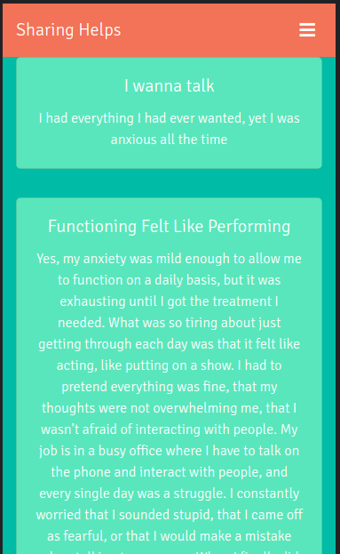
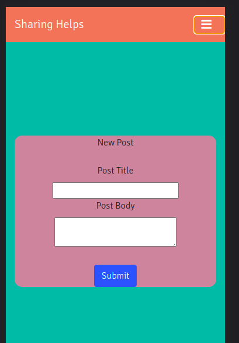

# Sharing-Helps


A web application where users can
anonymously share their stories and experiences.
Sharing stories helps in motivating people to speak
up about the things that happened to them.


## Tech Stack

**Client :** React.js, CSS \
**Server :** Node.js \
**Database :** Mongo Atlas


## API Reference

#### Get all stories

```
  GET /app/feed
```


### Post a story

```
  POST /app/feed
```

| Parameter | Type     | Description                       |
| :-------- | :------- | :-------------------------------- |
| `name`      | `string` | **Required**. Name of the user |
| `data`      | `string` | **Required**. data of the post |


## Run Locally

Clone the project

```bash
  git clone https://github.com/theydvgaurav/Sharing-Helps
```

Go to the project directories and Install dependencies

```bash
  cd Sharing-Helps && cd client && npm install
```
```bash
  cd Sharing-Helps && cd server && npm install
```
#### Note: In case the client folder is inaccesible (due to hosting), clone `https://github.com/theydvgaurav/Sharing-Helps-Client`

Start the Backend Server

```bash
  npm start
```
Start the application

```bash
  npm start
```


## Screenshots

<div align="center">
     
    
</div>


## Authors

- [Gaurav Yadav](https://www.github.com/theydvgaurav)
